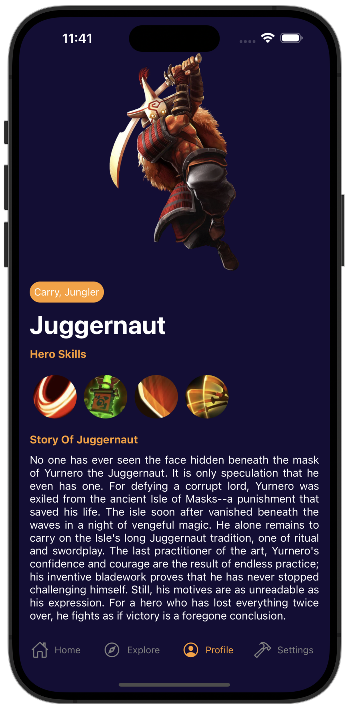
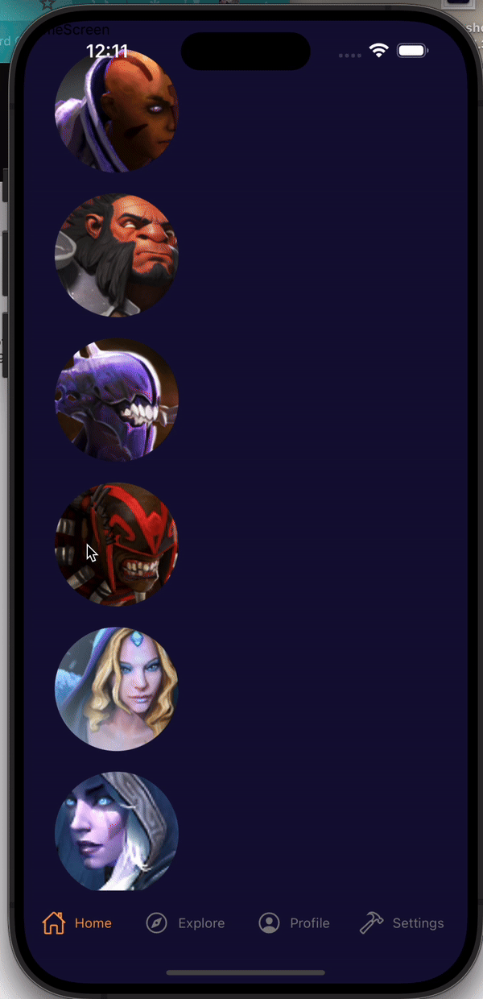

## Screenshots

## Demo

## To run this app
´´´yarn install´´´

´´´ios/pod install´´

### Legacy versions react-native on xCode 14
Fix Yoga |
RCT-Folly

### This command is required by use legacy react-native & node version
NODE_OPTIONS=--openssl-legacy-provider 

### Better screenshots remove shadow

´defaults write com.apple.screencapture disable-shadow -bool TRUE; killall SystemUIServer´ 